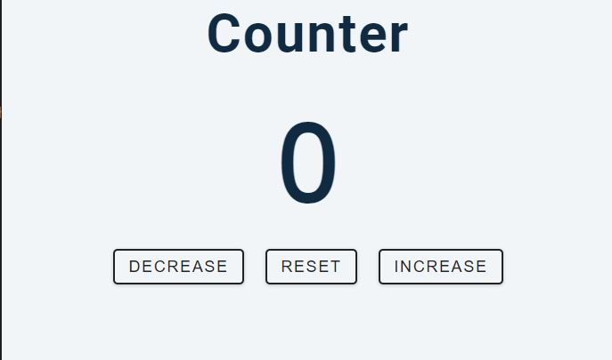

## Counter-app

- The Counter App is a simple web application that allows users to interact with a numeric counter. Users can increase and decrease the counter value, as well as reset it to zero. The application provides visual feedback by changing the counter value color based on its sign.

### Table of Contents

- [Introduction](#introduction)
- [Features](#features)
- [Demo](#demo)
- [Getting Started](#getting-started)
- [Usage](#usage)
- [Technologies Used](#technologies-used)
- [License](#license)

### Introduction

The Counter App showcases the basic functionalities of HTML, CSS, and JavaScript. By clicking on the buttons, users can manipulate the counter value and observe the real-time changes in color representation.

### Features

- Increment the counter value
- Decrement the counter value
- Reset the counter value to zero
- Visual feedback based on the counter value's sign:
  - Blue color for positive values
  - Orange color for negative values
  - Yellow color for zero value

## Demo



[View Live Demo](http://127.0.0.1:5500/index.html) 

## Getting Started

- To run the Counter App on your local machine, follow these steps:

1. Clone this repository:

   ```bash
   git clone 

2. Navigate to the project directory:

- Open the index.html file in a web browser to use the Counter App.

### Usage
1. Click the "Increase" button to increment the counter value.
2. Click the "Decrease" button to decrement the counter value.
3. Click the "Reset" button to set the counter value to zero.
### Technologies Used
- HTML
- CSS
- JavaScript